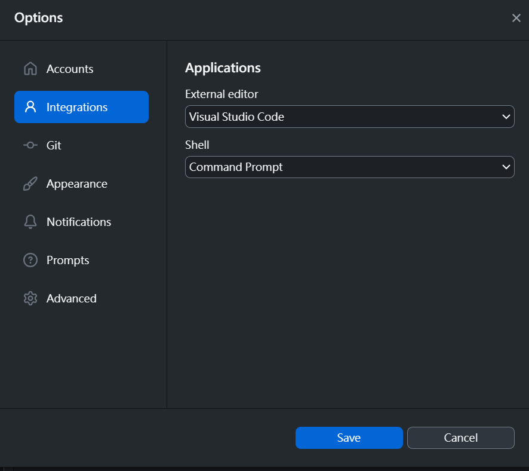
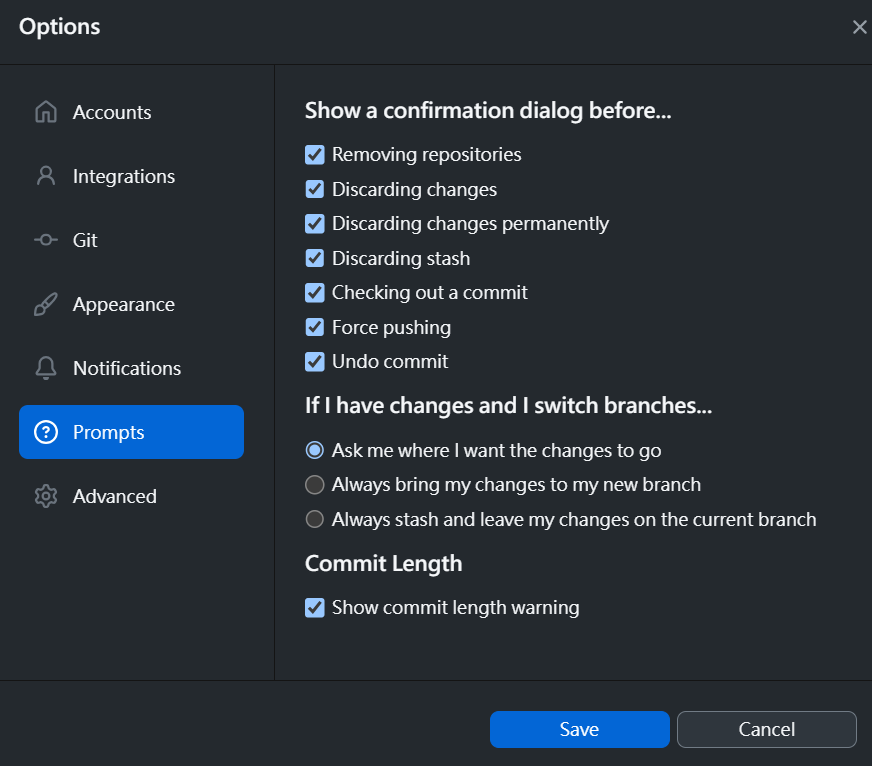

# Github & VSCode Tutorial

## Github
Github is a useful tool and website which helps to store code projects and faciliates developers to collaborate and work on the same project. All of the code behind the UES website is stored on Github, and all edits and changes to the website will be made through Github.

1. If you already have a Github account, you can skip this step. Go to [github.com](https://github.com/) and sign up for a new account. You can use either your school email or your personal email.
2. Got to settings > password and authentication on your Github account to set up two-factor authentication. Two-factor authentication helps to keep your account safe.
3. Feel free to change your profile description and settings
4. Tell your VP your Github username.

## Visual Studio Code

Visual Studio Code (VSCode) is a code editor software. It is by-far the most popular code editor, and contains a variety of different extention which helps to make your coding experience easier and more convenient.

1. Go to [Visual Studio Code](https://code.visualstudio.com/Download) and download the correct software for your operation system.
2. Click on extentions on the left side bar.
3. Search for the following extentions and install them: [Live Server](https://marketplace.visualstudio.com/items?itemName=ritwickdey.LiveServer) and [Live Share](https://marketplace.visualstudio.com/items?itemName=MS-vsliveshare.vsliveshare). Please install these extentions through VSCode directly, instead of through your browser.

## Github Desktop
Github Desktop is a software which provides and quick and easy way to do [Git operations](#git-operations). It also acts as a quick which connects the online repository stores on Github to your local device.

1. Go to [Github Desktop](https://desktop.github.com/) and download correct software for your operation system.
2. After installation, open Github desktop and sign into your Github account through it.
3. Go to file > options > integrations, and change your settings to match the following, then press save: 
4. Go to file > options > prompts, and change your settings to match the following, and press save: 
5. Feel free to change Github desktop's appearance and notification settings.
6. Go back to the Github website, and go to the [UES website repository](https://github.com/uesucsd/UES-Website).
7. Click on the drop down button beside the fork button on the top right of the page, and then click "Create a new fork".
8. Select your username under the owner section, and click "Create fork".
9. Github should automatically automatically bring you to your new fork, if not, you can find your fork under the list of repositories in your account.
10. Click on the green button that says "Code", and then click "Open with Github Desktop".
11. This should bring you back to Github Desktop with a pop up showing up. Click "clone".
12. The entire code from the UES respository has now been copied to your local machine. Click "open in Visual Studio Code" to check the code out and begin editing.

## Git Operations
Git operations makes up the basic system to working on a repository with other collaborators present. Normally Git operations are executed through GIT Bash and GIT UI, but with Github desktop present, these operations can now be executed without going to the command line.

This diagram shows the general flow of an editing process using Github Desktop: 

[Return to main page](README.md)