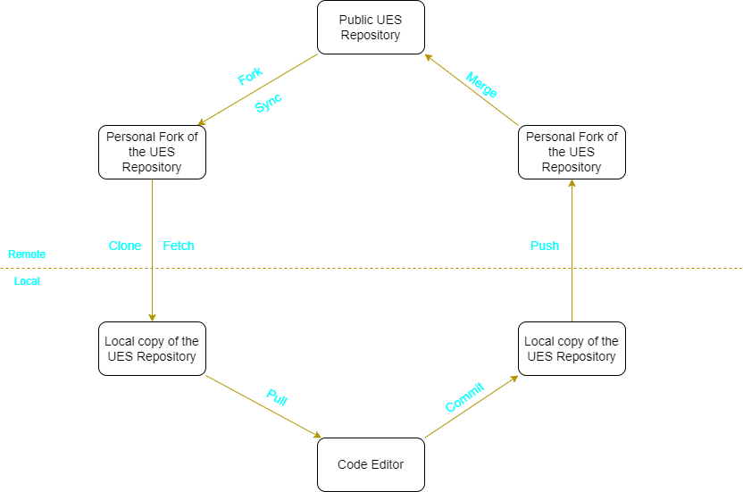

# Github & VSCode Tutorial

## Github
Github is a useful tool and website which helps to store code projects and facilitates developers to collaborate and work on the same project. All of the code behind the UES website is stored on Github, and all edits and changes to the website will be made through Github.

1. If you already have a Github account, you can skip this step. Go to [github.com](https://github.com/) and sign up for a new account. You can use either your school email or your personal email.
2. Go to settings > password and authentication on your Github account to set up two-factor authentication. Two-factor authentication helps to keep your account safe.
3. Feel free to change your profile description and settings
4. Tell your VP your Github username.

## Visual Studio Code

Visual Studio Code (VSCode) is a code editor software. It is by far the most popular code editor and contains a variety of different extensions which helps to make your coding experience easier and more convenient.

1. Go to [Visual Studio Code](https://code.visualstudio.com/Download) and download the correct software for your operation system.
2. Click on extensions on the left sidebar.
3. Search for the following extensions and install them: [Live Server](https://marketplace.visualstudio.com/items?itemName=ritwickdey.LiveServer) and [Live Share](https://marketplace.visualstudio.com/items?itemName=MS-vsliveshare.vsliveshare). Please install these extensions through VSCode directly, instead of through your browser.

## Github Desktop
Github Desktop is a software that provides and quick and easy way to do [Git operations](#git-operations). It also acts as a quick which connects the online repository stores on Github to your local device.

1. Go to [Github Desktop](https://desktop.github.com/) and download correct software for your operation system.
2. After installation, open Github desktop and sign into your Github account through it.
3. Go to file > options > integrations, and change your settings to match the following, then press save: 
4. Go to file > options > prompts, and change your settings to match the following, and press save: 
5. Feel free to change Github desktop's appearance and notification settings.
6. Go back to the Github website, and go to the [UES website repository](https://github.com/uesucsd/UES-Website).
7. Click on the drop-down button beside the fork button on the top right of the page, and then click "Create a new fork".
8. Select your username under the owner section, and click "Create fork".
9. Github should automatically automatically bring you to your new fork, if not, you can find your fork under the list of repositories in your account.
10. Click on the green button that says "Code", and then click "Open with Github Desktop".
11. This should bring you back to Github Desktop with a pop-up showing up. Click "clone".
12. The entire code from the UES repository has now been copied to your local machine. Click "open in Visual Studio Code" to check the code out and begin editing.

## Git Operations
Git operations make up the basic system for working on a repository with other collaborators present. Normally Git operations are executed through GIT Bash and GIT UI, but with Github desktop present, these operations can now be executed without going to the command line.

This diagram shows the general flow of an editing process using Github Desktop: 

- Fork: This operation creates a new fork, which is completely owned by you. Having a fork enables greater control for you over the repository, and will cause fewer conflicts with other collaborators on the main repository. Fork will only be used for the first instance when you create a personal copy of a public repository
- Sync: This operation is similar to fork, as this operation also fetches the code from the public repository to your personal fork of the repository.
- Clone: This operation clones the code in your personal copy of the repository to your local machine. This operation will only be used when it's the first time you create a local copy of the repository.
- Fetch: This operation is similar to clone, and it will update your local repository to match the code in your personal copy of the public repository.
- Pull: This operation pulls up the files stored in your local machine and opens them in your code editor.
- Commit: This operation logs your changes to your local machine's repository, and you can add a name and comment for each commit for better documentation.
- Push: This operation updates your personal copy of the repository with the files and code currently exist on your local repository.
- Merge: This operation updates the public repository with the contents from your local copy of the public repository. Because of the inherent danger caused by this operation, the UES repository only allows administrators to perform this operation. So as regular collaborators, you are required to create a pull request.
- Pull Request: Pull request is a request to merge your current copy of the public repository into the public repository. This request will prompt administrators to review your code and will merge your code into the public repository once they approve it.

[Return to main page](README.md)